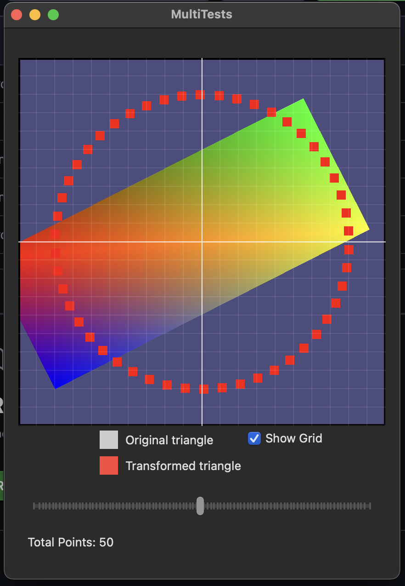

# Metal Sand Box

MetalSandBox is a Metal-based application designed as a learning platform for Metal graphics rendering on Apple platforms. This project serves as a practical implementation of concepts from the book ["Metal by Tutorials"](https://www.kodeco.com/books/metal-by-tutorials/v4.0) by Caroline Begbie, Tim Oliver, and Marius Horga.


## Demo's Features

- Render points and triangles using Metal shaders.
- Adjustable number of points.
- Toggleable grid display.

## Project Structure

- `ContentView.swift`: The main view of the application, containing the UI elements.
- `MetalView.swift`: A SwiftUI view that integrates with Metal to render graphics.
- `Renderer.swift`: The Metal renderer class that handles rendering points and triangles.
- `Shaders.metal`: The Metal shader functions used for rendering.
- And more...

## Point's Shader

```metal
vertex VertexOut point_vertex_main(
                                   constant uint &count [[buffer(12)]],
                                   constant float &timer [[buffer(11)]],
                                   uint vertexID [[vertex_id]])
{
    float radius = 0.8;
    float pi = 3.14159;
    float current = float(vertexID) / float(count);
    float2 position;
    position.x = radius * cos(2 * pi * current + timer);
    position.y = radius * sin(2 * pi * current + timer);
    VertexOut out {
        .position = float4(position, 0, 1),
        .color = float4(1, 0, 0, 1),
        .pointSize = 20
    };
    return out;
}
```

## Screenshots



We can see the usage of rotation, translation, and scaling in the Metal shaders.
The rectangle is originally a cube, but we scale it to a rectangle.
It is rotated around the bottom-left corner.
